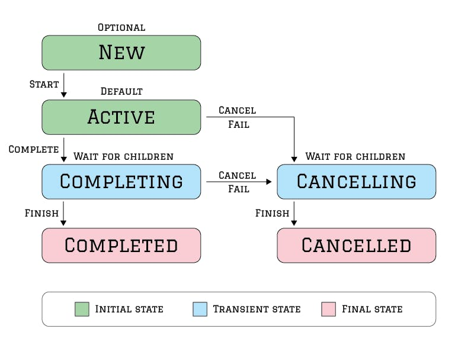

# Table of Contents
1. [Some concepts](#some-concepts)
2. [Features](#features)
3. [CoroutineContext](#coroutinescontext)
4. [Dispatchers](#dispatchers)
5. [CoroutineScope](#coroutinescope)
6. [Coroutine launchers](#coroutine-launchers)
7. [Scope builders](#scope-builders)
8. [Structured Concurrency](#structured-concurrency)
9. [Job](#job)
10. [Handling exceptions](#handling-exceptions)
11. [Best Practices and Recomendations](#best-practices-and-recomendations)
12. [Sources](#sources)

### Some concepts
* A *coroutine* is a concurrency design pattern that you can use on Android to simplify code that executes asynchronously. It is conceptually similar to a thread, in the sense that it takes a block of code to run that works concurrently with the rest of the code. However, a coroutine is not bound to any particular thread. It may suspend its execution in one thread and resume in another one.
* A suspending function is simply a function that can be paused and resumed at a later time. They can execute a long running operation and wait for it to complete without blocking.

### Features
Coroutines is the recommended solution for asynchronous programming on Android. Noteworthy features include the following:
* **Lightweight**: You can run many coroutines on a single thread due to support for suspension, which doesn't block the thread where the coroutine is running. Suspending saves memory over blocking while supporting many concurrent operations.
* **Fewer memory leaks**: Use structured concurrency to run operations within a scope.
* **Built-in cancellation support**: Cancellation is propagated automatically through the running coroutine hierarchy.
* **Jetpack integration**: Many Jetpack libraries include extensions that provide full coroutines support. Some libraries also provide their own coroutine scope that you can use for structured concurrency.

### CoroutineContext
* `CoroutineContext` is just a `Map` that stores a set of `Element` objects that have a unique `Key`. 
* `Element` is also a `CoroutineContext`and at the end it is anything a coroutine might need to run correctly, like `Job`, `Dispatcher`, `CoroutineName` (identify your coroutines for debug purposes), `CoroutineExceptionHandler`...
* `plus` operator is not associative. context1 + context2 is not the same as context2 + context1 since all the keys from the left context will be overwritten by the keys from the right context.

### Dispatchers
* `Main`: Use this dispatcher to run a coroutine on the main Android thread. This should be used only for interacting with the UI and performing quick work.
* `IO`: This dispatcher is optimized to perform disk or network I/O outside of the main thread.
* `Default` (*a.k.a.* computation): This dispatcher is optimized to perform CPU-intensive work outside of the main thread.

Keep in mind that `Dispatchers.IO` shares threads with `Dispatchers.Default`.

### CoroutineScope
* A `CoroutineScope` is just a simple wrapper for a `CoroutineContext`. 
* The intended purpose of a `CoroutineScope` - to enforce **structured concurrency**. It aimed for all coroutines to be launched in a defined scope, which would allow for an easy way to manage cancellation, exception handling and not allow resource leaking.
* Considerations when creating a scope using the CoroutineScope() function: 
  * `context` parameter is mandatory.
  * if you don't pass a `Job` element, a default `Job()` will be created since a scope must have a Job to enforce structured concurrency.
  * if we don't pass a coroutine dispatcher, `Dispatchers.Default` will be used.
* `GlobalScope` is running during the whole lifetime of an application.

```kotlin
// this is a function that returns an instance
// of CoroutineScope, not a constructor
val mainScope = MainScope()

val scope1 = CoroutineScope(SupervisorJob())
val scope2 = CoroutineScope(SupervisorJob() + Dispatchers.IO)
val scope3 = CoroutineScope(SupervisorJob() + CoroutineName("MyScope"))
```

### Coroutine launchers
* We cannot launch a new coroutine without a scope.

```kotlin
public fun CoroutineScope.launch(
    context: CoroutineContext = EmptyCoroutineContext,
    start: CoroutineStart = CoroutineStart.DEFAULT,
    block: suspend CoroutineScope.() -> Unit
): Job 

public fun <T> CoroutineScope.async(
    context: CoroutineContext = EmptyCoroutineContext,
    start: CoroutineStart = CoroutineStart.DEFAULT,
    block: suspend CoroutineScope.() -> T
): Deferred<T>
```

* `launch`: launches a new coroutine concurrently with the rest of the code, which continues to work independently.
* `async`: conceptually, `async` is just like `launch`. It starts a separate coroutine which is a light-weight thread that works concurrently with all the other coroutines. The difference is that `launch` returns a Job and does not carry any resulting value, while async returns a `Deferred` — a light-weight non-blocking future that represents a promise to provide a result later.

*Note*: Deferred is just a `Job` that returns a result.

### Scope builders
* `withContext` is similar to that of `coroutineScope()`, its intended purpose is to switch context within a suspending function, not to provide a scope.
* We need suspending scope builders because we cannot launch new coroutines outside of a coroutine scope. That also means we cannot launch new coroutines from suspending functions since they are regular functions that undergo a "minor" transformation during compilation.
* An important thing to note about suspending scope builders is that they return only when all their child coroutines have finished. This enforces structured concurrency and adheres to one of the main ideologies of the coroutine library - that suspending functions execute sequentially, just like the regular code.
* The `supervisorScope()` is the same as `coroutineScope()`, but uses a `SupervisorJob` for its context instead of a `Job`.

```kotlin
public suspend fun <R> coroutineScope(block: suspend CoroutineScope.() -> R): R

public suspend fun <R> supervisorScope(block: suspend CoroutineScope.() -> R): R

public suspend fun <T> withContext(
    context: CoroutineContext,
    block: suspend CoroutineScope.() -> T
): T
```

### Structured Concurrency
The idea behind structured concurrency is quite simple, regardless of how intimidating it might sound. It requires every coroutine to run in a defined scope that manages a parent-child relationship between coroutines. This achieves a couple of things:
* Coroutines are always accounted for and never leak resources;
* Parent coroutines always wait for children to complete, which makes concurrency predictable;
* Exceptions are always propagated and never lost;
* Cancellation is easy and doesn't require passing cancellation tokens to children like many other asynchronous solutions.

To learn more about how Kotlin coroutines were designed and how structured concurrency came about, I highly recommend watching this presentation from Roman Elizarov: https://www.youtube.com/watch?v=Mj5P47F6nJg

### Job
A `Job` is an entity with a lifecycle that acts as a handle to a coroutine. Every coroutine's `Job` goes through several states that culminate in its completion.



A Job has six states which fall under three main categories:
  1. Initial state - **New**, **Active**
  2. Transient state - **Completing**, **Cancelling**
  3. Final state - **Completed**, **Cancelled**

A launched coroutine immediately goes into the **Active** state, unless an optional parameter `start = CoroutineStart.LAZY` is passed to the coroutine builder, in which case it starts in the **New** state. A `Job` in the **New** state can be started and moved to the **Active** state by either calling `job.start()` or `job.join()`.
When a coroutine has finished its work, it goes to the **Completing** state, where it awaits the completion of all its children - which, as you now know, is an integral part of the structured concurrency principle.
If an exception or cancellation happens during either the **Active** or **Completing** state, the `Job` moves to the **Cancelling** state, where it awaits the cancellation of all its children.
After all the children have finished or are cancelled, the `Job` moves to either the **Completed** or **Cancelled** state.

#### Exception propagation
* If a child coroutine fails, it propagates the exception to its parent.
* The parent cancels itself and consequently cancels all its children. The parent will wait in the **Cancelling** state until all the children are cancelled (important).
* The parent propagates the exception up to its parent or throws the exception if it is a root coroutine and the exception was not caught.
* `launch` automatically propagates exceptions when they are thrown.
* When `async` is used as a **root coroutine**, it will rely on the user to consume the exception. The exception is thrown when `.await()` is called on the `Deferred` result. However, when using `async` as a child coroutine or inside a `coroutineScope`, the exception will be thrown without calling `.await()` and immediately propagated to the parent, even if wrapped in `try-catch`. 

#### Job vs SupervisorJob
A regular `Job` cancels itself and propagates exceptions all the way to the top level, while `SupervisorJob` relies on coroutines to handle their own exceptions and doesn't cancel other coroutines.

### Handling exceptions
* `try-catch`
* `CoroutineExceptionHandler`
* `runCatching`

```kotlin
public inline fun <T, R> T.runCatching(block: T.() -> R): Result<R> {
    return try {
        Result.success(block())
    } catch (e: Throwable) {
        Result.failure(e)
    }
}
...
    launch {
        delay(10)

        val result = runCatching {
            throw IllegalArgumentException("An absolute disaster!")
        }

        when {
            result.isSuccess -> println("I got: ${result.getOrNull()}")
            result.isFailure -> println("I have recovered from: ${result.exceptionOrNull()?.message}")
        }
    }
```

* Job’s `invokeOnCompletion`

```kotlin
job.invokeOnCompletion { throwable ->
    when (throwable) {
        is CancellationException -> println("Job was cancelled!")
        is Throwable -> println("Job failed with exception!")
        null -> println("Job completed normally!")
    }
}
```

*Note*: `CancellationExceptions` will not get passed to a `CoroutineExceptionHandler`, therefore it should not be be relied upon as a resource clean-up mechanism. For example, a common source of bugs in Android is using a `CoroutineExceptionHandler` to revert the state of UI in case of an exception inside a ViewModel. In most cases, there is nothing wrong with that, but **keep in mind that in that case explicitly cancelling your coroutines might result in a broken UI state**.

##### Suppressed exceptions
One thing to keep in mind is that if multiple children fail with an exception, the first thrown exception will get propagated, while others exceptions will get attached to it as suppressed exceptions:

```kotlin
private val scope = CoroutineScope(Job() + Dispatchers.Default)

fun main(): Unit = runBlocking {
    scope.launch {
        launch {
            delay(100)
            throw IllegalStateException("First Boom!")
        }

        launch {
            delay(100)
            throw IllegalStateException("Second Boom!")
        }
    }
    delay(500)
}

Output:
Exception in thread "DefaultDispatcher-worker-2" 
java.lang.IllegalStateException: First Boom!
 ...
 Suppressed: java.lang.IllegalStateException: Second Boom!
 ...
```


### Best Practices and Recomendations
* The only elements you should ever consider manually adding to the context when launching a new coroutine are `CoroutineDispather` (or MainCoroutineDispatcher) and `CoroutineExceptionHandler`. In some specific debug cases, you can also use `CoroutineName`.
* Suspending functions add a new dimension to code design. It was blocking/non-blocking without coroutines and now there is also suspending/non-suspending on top of that. To make everybody’s life simpler we use the following convention: **suspending functions do not block the caller thread**.
The means to implement this convention are provided by the `withContext` function. (based on https://elizarov.medium.com/blocking-threads-suspending-coroutines-d33e11bf4761)
* Coroutines are very cheap and we are encouraged to create them as we see fit. We can launch coroutines in different ways from many different places. Remember **Coroutines ARE light-weight**.
* `CoroutineScope` must be bound to the lifecycle of the component. In Android, we have `viewModelScope` attached to the `ViewModel`, and `lifecycleScope` attached to the `LifecycleOwner`.
* Two very good rules of thumb to make using coroutines predictable and avoid unintentional leaks and behaviors: (see: https://github.com/Kotlin/kotlinx.coroutines/issues/1001#issuecomment-814261687)
  * When using a `CoroutineContext` you should **not** have a Job there.
  * When using a `CoroutineScope` you should **always** have a Job there.


### Sources:
* https://maxkim.eu/things-every-kotlin-developer-should-know-about-coroutines-part-1-coroutinecontext
* https://maxkim.eu/things-every-kotlin-developer-should-know-about-coroutines-part-2-coroutinescope
* https://maxkim.eu/things-every-kotlin-developer-should-know-about-coroutines-part-3-structured-concurrency
* https://maxkim.eu/things-every-kotlin-developer-should-know-about-coroutines-part-4-exception-handling
* https://elizarov.medium.com/blocking-threads-suspending-coroutines-d33e11bf4761
* https://kotlinlang.org/docs/coroutines-basics.html
* https://developer.android.com/kotlin/coroutines